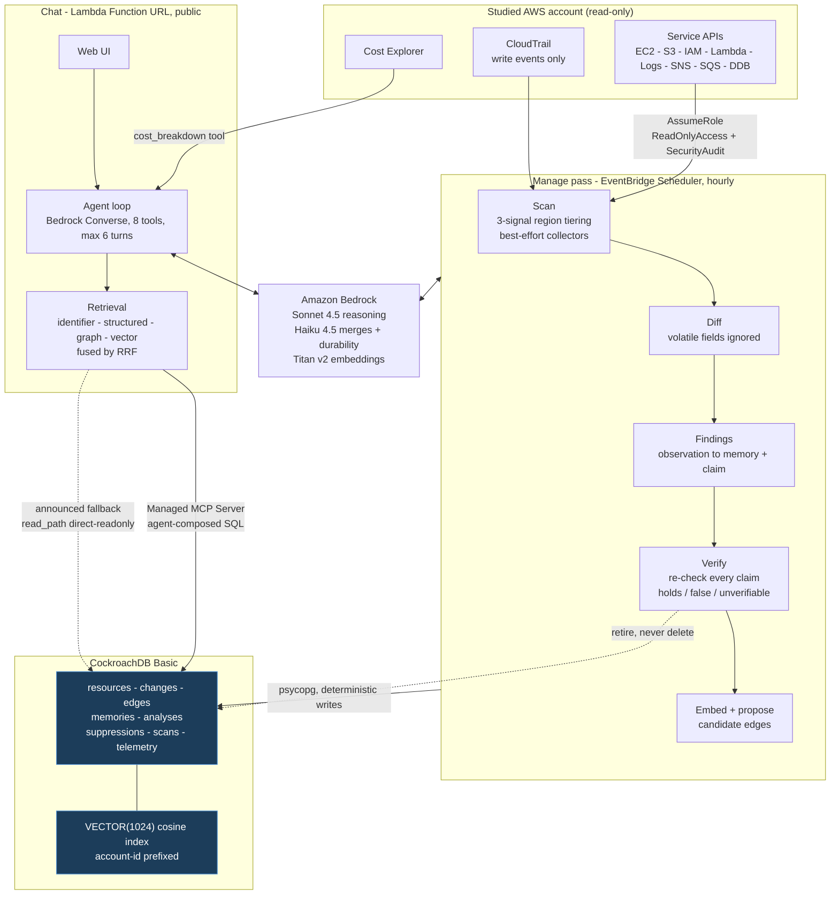

# AWS Biographer


[](LICENSE)
[](https://www.python.org/)

**Every comparable AWS tool is a stateless snapshot. This one remembers — and its memory checks itself.**

Staleness is the unsolved problem in agent memory, because facts about people
cannot be cheaply re-verified. In AWS, every conclusion is verifiable with an
API call. So this agent's memory carries the claim that makes it true and a
cheap way to re-check it, and it retires what has become false — automatically,
visibly, without being asked.

> AWS forgets after 90 days. The agent doesn't.

Built for the CockroachDB × AWS [**Build with Agentic Memory**](https://cockroachdb-ai.devpost.com/) contest.

## Try it

**https://wp7s54jbd3ztuoke4xfshum2d40ocsfk.lambda-url.us-east-1.on.aws**

Public, no signup, running against the seeded sandbox account described below.
Nothing to install. Ask it:

- *"What looks abandoned or wasteful in my account?"*
- *"What do you know about my account?"*
- *"What breaks if I delete the build runner?"*
- *"What changed recently, and who did it?"*

Answers cite real identifiers you can paste into the AWS console, and each one
reports which path served it — `read_path: mcp` means the agent composed its own
SQL and ran it through CockroachDB's Managed MCP Server.

You can also tell it things (*"that untagged instance is the build runner"*),
and it will still know on your next visit. Ask *"has anything you believed
stopped being true?"* to see the retirement record — empty until something in
the account changes under it, which is exactly the point.

---

## What it does

Answers natural-language questions about an AWS account by investigating live
resources, and accumulates durable knowledge about that account over time.

- **Current state** — "what EC2 instances do I have?"
- **Cost attribution** — "I'm spending $10 a month, on what?"
- **History** — "when did this get detached, and by whom?"
- **Waste** — "what looks abandoned?" (needs duration, not a snapshot)
- **Relationships** — "what breaks if I delete this?"
- **Convention** — "which region is prod?" (only knowable from you)
- **Meta** — "what do you know about my account?"

Every answer referencing a resource carries an ARN or an identifier you can
paste into the console. That is the difference between a demo and a tool.

## Three claims

**Zero-enablement.** Works against an account with nothing turned on. No AWS
Config, no CloudTrail trails, no Cost and Usage Report pipeline, no installed
agents. It reads only what AWS already exposes by default.

**Persistent memory.** Conclusions, human annotations, account conventions, and
a change history that outlives what AWS itself retains.

**Verifiable memory.** Staleness becomes a measured, displayed property rather
than a silent decay.

## Read-only, enforced in IAM

The agent never creates, modifies, or deletes a resource in the account it
studies. That boundary lives in an IAM role with an external ID, not in a
convention in the code. CockroachDB is written to freely; AWS is not written to
at all.

---

## How memory works

Three tiers, all in CockroachDB:

| Tier | What it holds | Why |
|---|---|---|
| **Current state** | one row per resource, overwritten each scan | a cache, so trivial questions don't trigger a rescan |
| **Change log** | append-only, deltas only | the evidence trail behind conclusions — "how do you know?" |
| **Conclusions** | the actual memory, with embeddings | what would be *gone* if it were forgotten |

What earns a place: not things cheaply re-derivable (an EIP is unattached —
recompute it), but things only knowable over time (unattached *since March*) and
things supplied by a human (that untagged instance is the build runner), which
are the highest value of all.

An explicit "remember this" is never filtered, judged, or overruled. On
collision, memories merge inline; if a merge fails, the new memory is inserted
alongside the old rather than lost.

## Why no graph database

Resource relationships live in an adjacency table in CockroachDB, traversed with
recursive CTEs. Blast-radius and feature-membership questions are shallow —
depth two or three — at hundreds to low thousands of resources. That outruns a
network hop to a separate graph store and removes a service that would otherwise
need to stay alive.

Graph traversal, vector similarity, full-text, and relational filters in one
store, one query, one transaction. *"We didn't need a graph database"* is a
stronger architectural claim here than adding one.

Edges are facts. Vectors are hunches. Vector similarity may *propose* a
relationship; only a human confirms one.

---

## Architecture



**Read and write paths are split on purpose.** The agent reads through the
Managed MCP Server, composing its own SQL. The application writes through
psycopg, because writes are deterministic code and no model needs to compose an
INSERT. `insert_rows` is deliberately absent from the agent's tool surface.

**CockroachDB tools used:** Managed MCP Server (the agent's read path),
Distributed Vector Indexing (memory and cached-analysis embeddings,
`VECTOR(1024)`, cosine, account-prefixed).

**AWS services used:** Bedrock, Lambda, EventBridge Scheduler, IAM, KMS, Secrets
Manager, CloudWatch Logs, plus the read-only APIs of every service it
inventories.

## Repository layout

```
src/biographer/
  config.py       environment into a frozen dataclass
  aws.py          session factory, role assumption, retry policy
  db.py           CockroachDB pool, migrations, vector-index probe
  scan/           region tiering, collectors, CloudTrail backfill
  memory/         memory tiers, write path, merge, verification
  agent/          Bedrock loop, tools, retrieval lanes
migrations/       numbered SQL, applied in order
seed/             Terraform that builds the demo account's deliberate mess
docs/decisions/   ADRs — every non-obvious call and why
tests/
```

## Status

All fourteen build phases implemented and verified against a real AWS account.

| Phase | State |
|---|---|
| 1 — Foundation: schema, migrations, vector index | done |
| 2 — Inventory: tiered scan, 26 collectors | done |
| 3 — The free past: CloudTrail backfill | done |
| 4 — Scan-over-scan diffing | done |
| 5 — Resource graph, recursive-CTE traversal | done |
| 6 — Memory: embeddings, merge, durability filter | done |
| 7 — Agent read path through the MCP server | done |
| 8 — Chat agent, tool loop, front end | done |
| 9 — Four-lane retrieval with RRF fusion | done |
| 10 — Work reuse: cached analyses | done |
| 11 — The manage pass: verification and retirement | done |
| 12 — Human layer: suppressions, edges, proposals | done |
| 13 — Cost attribution | done |
| 14 — Telemetry, spend controls, deployment | done |

**Note on Phase 7.** The agent reads through the Managed MCP Server with a
service-account key. Any answer that runs agent-composed SQL reports which
path served it (`read_path: mcp`); answers that need no SQL report none.
A direct read-only connection remains as an announced
fallback: if the service account ever loses its Cloud RBAC grant, the product
keeps answering and says so, rather than silently pretending it is still
reading through MCP.

Terraform drift analysis was scoped in and is the one agreed item that did not
ship; the groundwork is in `seed/`.

## Running it locally

**You need:** Python 3.13, a CockroachDB cluster (the free Basic tier is
enough), Amazon Bedrock model access, and AWS credentials for a **non-root**
principal — AWS forbids root from assuming roles, so the read-only boundary
cannot be exercised without one.

### 1. Set up the read-only role

In the account you want to study, create an IAM role that trusts your principal
and requires an external ID, with `ReadOnlyAccess` and `SecurityAudit`
attached. Nothing else. That role is the only way in, and it cannot write.

### 2. Install and configure

```bash
pip install -e ".[dev]"
cp .env.example .env
```

Fill in `DATABASE_URL`, `BIOGRAPHER_ROLE_ARN`, `BIOGRAPHER_EXTERNAL_ID`, and
the two `CRDB_*` values from a CockroachDB Cloud service account. Every entry
point loads `.env` automatically.

### 3. Build the memory

```bash
python -m biographer.db              # apply migrations, verify the vector index
python -m biographer.scan.runner     # inventory the account
python -m biographer.scan.cloudtrail # backfill the free 90-day past
python -m biographer.manage          # findings, verification, retirement
```

### 4. Chat with it

```bash
python -m biographer.agent.server
```

Serves the same UI as the hosted demo on `http://localhost:8080`.

```bash
pytest                               # 38 unit tests, no cloud access needed
python scripts/verify_memory.py      # acceptance checks, needs the cluster
```

---

## Deploying your own copy

Two Lambdas, one scheduler rule, no servers to keep alive. Roughly ten minutes.

### 1. Put the secrets where the Lambdas can reach them

```bash
python scripts/put_secrets.py
```

Reads `.env` in-process and writes to Secrets Manager under a dedicated KMS
key. Values are never printed, never passed on a command line, and never read
back. The functions receive them at runtime as CloudFormation dynamic
references, so they never appear in a template, a stack parameter, or a
deployment log either.

### 2. Build the deployment package

```bash
python scripts/build_lambda.py
```

Cross-compiles Linux wheels with pip's `--platform` flag, so no Docker is
needed. `boto3` is excluded because the Lambda runtime already ships it.

### 3. Deploy

```bash
cd infra && npx aws-cdk@latest deploy --require-approval never
```

Set `CDK_DEFAULT_ACCOUNT` and `CDK_DEFAULT_REGION` first if your shell does not
already have them. The stack outputs the chat Function URL.

### What you get

| Resource | Purpose |
|---|---|
| Chat Lambda + Function URL | the public demo, 1024 MB, 120s timeout |
| Manage Lambda + EventBridge Scheduler | hourly scan, verification, retirement |
| Secrets Manager secret + KMS key | configuration, never in the template |
| CloudWatch log groups | with retention set |

### Before you point it at anything real

- **Raise `FINDING_MIN_AGE_MINUTES`.** The default of 30 is tuned for a
  freshly seeded demo; hours or days is right for a live account.
- **Set a spend ceiling you can live with.** `SPEND_CEILING_USD` in
  `src/biographer/agent/server.py` defaults to $40 and is a *lifetime* total,
  not a daily reset — nothing about it resets. Past it, the demo returns a
  polite message instead of an answer. Set `SPEND_CEILING_USD` in the
  function's environment to change it without redeploying.
- **Decide whether the Function URL should stay public.** It is unauthenticated
  by design here, with a 500-character question cap and 10 requests per minute
  per IP as the only gate.

`.env` is git-ignored and must stay that way. The read-only role's ARN is
deliberately absent from this repository — a published assumable role ARN is an
open door.

## Demo account

The hosted demo runs against a **seeded sandbox**, not a production account. The
`seed/` Terraform builds its deliberate mess: an untagged instance, an
unattached Elastic IP, orphaned volumes, inconsistently named buckets, a
security group open to the world, never-invoked functions. Everything is
Terraform-managed so `terraform destroy` removes all of it.

## Documentation

- [docs/decisions/](docs/decisions/) — every non-obvious call and why, as ADRs
- [docs/follow-ups.md](docs/follow-ups.md) — known gaps and what still needs a human
- [docs/design-summary.md](docs/design-summary.md) — the full design, section by section
- [CONTRIBUTING.md](CONTRIBUTING.md) — this repo does not accept pull requests, and why
- `scripts/verify_*.py` — runnable acceptance checks, one per phase

## License

MIT — see [LICENSE](LICENSE).

All code in this repository was written new for this submission.
