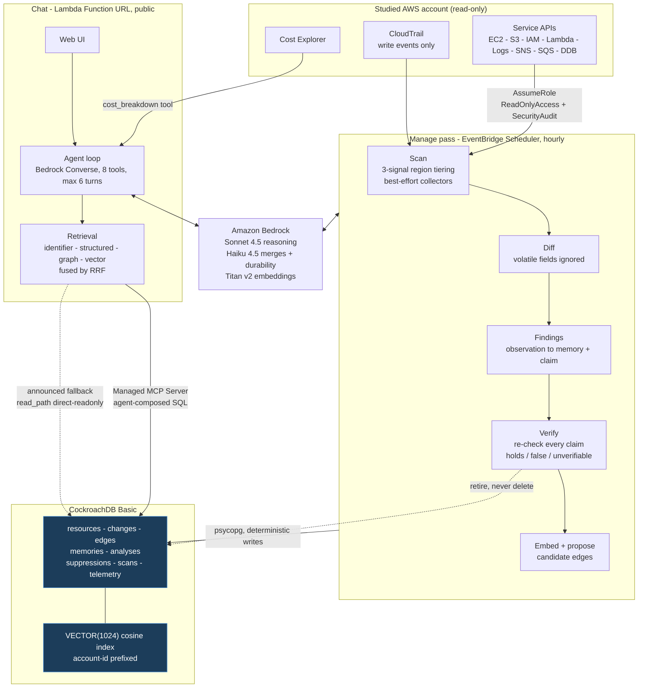

# AWS Biographer

**Every comparable AWS tool is a stateless snapshot. This one remembers — and its memory checks itself.**

Staleness is the unsolved problem in agent memory, because facts about people
cannot be cheaply re-verified. In AWS, every conclusion is verifiable with an
API call. So this agent's memory carries the claim that makes it true and a
cheap way to re-check it, and it retires what has become false — automatically,
visibly, without being asked.

> AWS forgets after 90 days. The agent doesn't.

Built for the CockroachDB × AWS **Build with Agentic Memory** contest.

---

## What it does

Answers natural-language questions about an AWS account by investigating live
resources, and accumulates durable knowledge about that account over time.

- **Current state** — "what EC2 instances do I have?"
- **Cost attribution** — "I'm spending $10 a month, on what?"
- **History** — "when did this get detached, and by whom?"
- **Waste** — "what looks abandoned?" (needs duration, not a snapshot)
- **Relationships** — "what breaks if I delete this?"
- **Convention** — "which region is prod?" (only knowable from you)
- **Meta** — "what do you know about my account?"

Every answer referencing a resource carries an ARN or an identifier you can
paste into the console. That is the difference between a demo and a tool.

## Three claims

**Zero-enablement.** Works against an account with nothing turned on. No AWS
Config, no CloudTrail trails, no Cost and Usage Report pipeline, no installed
agents. It reads only what AWS already exposes by default.

**Persistent memory.** Conclusions, human annotations, account conventions, and
a change history that outlives what AWS itself retains.

**Verifiable memory.** Staleness becomes a measured, displayed property rather
than a silent decay.

## Read-only, enforced in IAM

The agent never creates, modifies, or deletes a resource in the account it
studies. That boundary lives in an IAM role with an external ID, not in a
convention in the code. CockroachDB is written to freely; AWS is not written to
at all.

---

## How memory works

Three tiers, all in CockroachDB:

| Tier | What it holds | Why |
|---|---|---|
| **Current state** | one row per resource, overwritten each scan | a cache, so trivial questions don't trigger a rescan |
| **Change log** | append-only, deltas only | the evidence trail behind conclusions — "how do you know?" |
| **Conclusions** | the actual memory, with embeddings | what would be *gone* if it were forgotten |

What earns a place: not things cheaply re-derivable (an EIP is unattached —
recompute it), but things only knowable over time (unattached *since March*) and
things supplied by a human (that untagged instance is the build runner), which
are the highest value of all.

An explicit "remember this" is never filtered, judged, or overruled. On
collision, memories merge inline; if a merge fails, the new memory is inserted
alongside the old rather than lost.

## Why no graph database

Resource relationships live in an adjacency table in CockroachDB, traversed with
recursive CTEs. Blast-radius and feature-membership questions are shallow —
depth two or three — at hundreds to low thousands of resources. That outruns a
network hop to a separate graph store and removes a service that would otherwise
need to stay alive.

Graph traversal, vector similarity, full-text, and relational filters in one
store, one query, one transaction. *"We didn't need a graph database"* is a
stronger architectural claim here than adding one.

Edges are facts. Vectors are hunches. Vector similarity may *propose* a
relationship; only a human confirms one.

---

## Architecture



**Read and write paths are split on purpose.** The agent reads through the
Managed MCP Server, composing its own SQL. The application writes through
psycopg, because writes are deterministic code and no model needs to compose an
INSERT. `insert_rows` is deliberately absent from the agent's tool surface.

**CockroachDB tools used:** Managed MCP Server (the agent's read path),
Distributed Vector Indexing (memory and cached-analysis embeddings,
`VECTOR(1024)`, cosine, account-prefixed).

**AWS services used:** Bedrock, Lambda, EventBridge Scheduler, IAM, KMS, Secrets
Manager, CloudWatch Logs, plus the read-only APIs of every service it
inventories.

## Repository layout

```
src/biographer/
  config.py       environment into a frozen dataclass
  aws.py          session factory, role assumption, retry policy
  db.py           CockroachDB pool, migrations, vector-index probe
  scan/           region tiering, collectors, CloudTrail backfill
  memory/         memory tiers, write path, merge, verification
  agent/          Bedrock loop, tools, retrieval lanes
migrations/       numbered SQL, applied in order
seed/             Terraform that builds the demo account's deliberate mess
docs/decisions/   ADRs — every non-obvious call and why
tests/
```

## Live demo

**https://wp7s54jbd3ztuoke4xfshum2d40ocsfk.lambda-url.us-east-1.on.aws**

Public, unauthenticated, running against the seeded sandbox described below.

## Status

All fourteen build phases implemented and verified against a real AWS account.

| Phase | State |
|---|---|
| 1 — Foundation: schema, migrations, vector index | done |
| 2 — Inventory: tiered scan, 26 collectors | done |
| 3 — The free past: CloudTrail backfill | done |
| 4 — Scan-over-scan diffing | done |
| 5 — Resource graph, recursive-CTE traversal | done |
| 6 — Memory: embeddings, merge, durability filter | done |
| 7 — Agent read path through the MCP server | done, see caveat |
| 8 — Chat agent, tool loop, front end | done |
| 9 — Four-lane retrieval with RRF fusion | done |
| 10 — Work reuse: cached analyses | done |
| 11 — The manage pass: verification and retirement | done |
| 12 — Human layer: suppressions, edges, proposals | done |
| 13 — Cost attribution | done |
| 14 — Telemetry, spend controls, deployment | done |

**Note on Phase 7.** The agent reads through the Managed MCP Server with a
service-account key. Any answer that runs agent-composed SQL reports which
path served it (`read_path: mcp`); answers that need no SQL report none.
A direct read-only connection remains as an announced
fallback: if the service account ever loses its Cloud RBAC grant, the product
keeps answering and says so, rather than silently pretending it is still
reading through MCP.

Terraform drift analysis was scoped in and is the one agreed item that did not
ship; the groundwork is in `seed/`.

## Running it

Requires Python 3.13, a CockroachDB cluster, and AWS credentials for a
**non-root** principal that can assume the read-only role.

```bash
pip install -e ".[dev]"
cp .env.example .env   # fill in DATABASE_URL and the role settings
python -m biographer.db          # apply migrations, verify the vector index
python -m biographer.scan.runner # inventory the account
python -m biographer.scan.cloudtrail  # backfill the free 90-day past
pytest
```

`.env` is git-ignored and must stay that way. The read-only role's ARN is
deliberately absent from this repository — a published assumable role ARN is an
open door.

## Demo account

The hosted demo runs against a **seeded sandbox**, not a production account. The
`seed/` Terraform builds its deliberate mess: an untagged instance, an
unattached Elastic IP, orphaned volumes, inconsistently named buckets, a
security group open to the world, never-invoked functions. Everything is
Terraform-managed so `terraform destroy` removes all of it.

## Documentation

- [docs/decisions/](docs/decisions/) — every non-obvious call and why
- [docs/follow-ups.md](docs/follow-ups.md) — what still needs a human
- `scripts/verify_*.py` — runnable acceptance checks for each phase

## License

MIT — see [LICENSE](LICENSE).

All code in this repository was written new for this submission.
